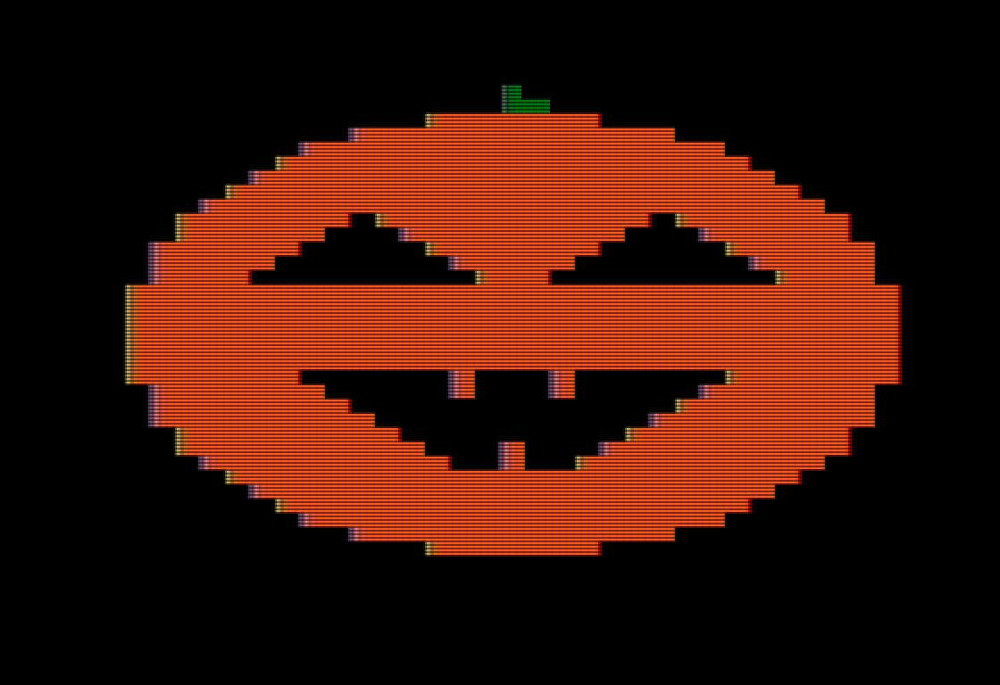

# BigMouth-Jack-Apple

---

| **Big Bmouth Jack Demo -- Version 00 - Port from VIC-20 to Atari to TI to Apple** |
| ------- |
|  | 

---

BigMouth Jack is originally a VIC-20 program by Jack Salzman written in 1981.

The program was republished by COMPUTE!'s Gazette in Issue 4, October 2025.

I did a simple port to the Atari 8-bit computers' Atari BASIC, with a few enhancements.

The Apple ][ version was written and tested on the AppleWin emulator.

Since Apple doesn't have redefineable characters this is done with low res graphics.

I adapted an example of drawing circles using the Bresenham algorithm to draw the pumpkin itself.

Press the Enter key to animate the mouth.
Press the Escape key to end the program.

---

Files Included:

* APLBMJ.TXT --- Text File written on a PC. Copy and then paste into AppleWin (Shift-Insert) should work fine.
* APLBIGMJ#fc0801 -- This is the BASIC program saved in AppleWin to a virtual floppy disk and then extracted by CiderPress. Not sure if this is helpful or an improvement. Let me know.

---
